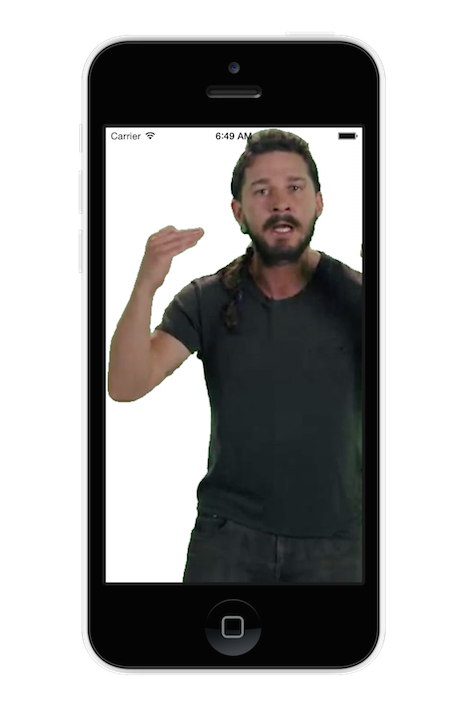

# InspireKit
Inspire your users with the wise words of Shia LaBeouf. 

This library flashes an image of Shia LaBeouf while reciting a line from the [infamous video](https://www.youtube.com/watch?v=nuHfVn_cfHU). 

Advice sound bites include:

* DO IT!
* If you're tired of starting over, stop giving up! 
* JUST DO IT!
* Make your dreams come true
* Nothing is impossible 
* What are you waiting for!?
* Yesterday you said tomorrow
* Yes you can!
* Anyone else would quit, and you're not gonna stop there!

The combination of sound and image is random. Simply drop into your app and inspire your users. 




## Installation
- CocoaPods: 

``` ruby
pod 'InspireKit'
```

- Manually: 

Copy `/InspireKit/*` to your App's directory. Link to AVFoundation. 

## Usage
``` objc
InspireKit *inspireKit = [InspireKit alloc] initWithTargetView:self.view]; // Pass it a view to present images on
```

Then, simply: 
`[inspireKit inspire];`

## Roadmap (Feel free to send a PR)

  * Tidy up images
  * Fix image placement (see `TODO`)
  
## Legal Stuff
The segment of video was found [here](https://vimeo.com/125095515) and was released under a [Creative Commons Attribution Non-Commercial Share-Alike licence](http://creativecommons.org/licenses/by-nc-sa/3.0/) meaning you are free to remix and have as much fun as you like.

Props to LaBeouf, Rönkkö & Turner in collaboration with Central Saint Martins BA Fine Art 2015 students. csmbafa15.co.uk
